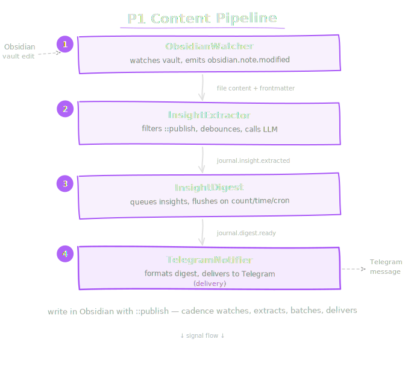
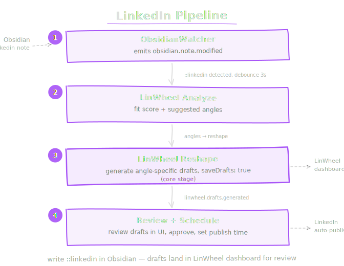

# Cadence

> Ambient intelligence via typed signals, sources, and responders.

Cadence is OpenClaw's event-driven automation layer. Instead of waiting for a user message, the gateway reacts to things that happen — a file changes in your Obsidian vault, a scheduled time arrives, a learning insight fires — and takes action automatically.

## How it works

Cadence has three building blocks:

1. **Signals** — Typed events that describe something that happened (`obsidian.note.modified`, `cadence.cron.fired`, `journal.insight.extracted`).
2. **Sources** — Watchers that detect changes and emit signals. The Obsidian watcher monitors your vault for file edits. The cron bridge fires signals on a schedule.
3. **Responders** — Handlers that subscribe to signals and do work. The insight extractor sends journal content to an LLM. The digest responder batches insights and delivers them to Telegram.

Signals flow through a central **bus**. Sources push signals onto the bus; responders consume them. Each responder declares which signal types it cares about. Handlers run sequentially — no race conditions, no lost events. If a handler throws, the bus logs the error and continues.

## P1 Content Pipeline

The first shipped pipeline turns journal entries into publishable insights:

<div style="max-width: 600px; margin: 1rem auto;">
  
</div>

You write in Obsidian. Cadence watches, extracts, batches, and delivers — without being asked.

## LinkedIn Pipeline

The LinWheel Publisher turns notes into LinkedIn drafts:

<div style="max-width: 600px; margin: 1rem auto;">
  
</div>

Write `::linkedin` at the top of an Obsidian note. Cadence detects it, runs the content through LinWheel's analyze + reshape pipeline, and saves drafts to the [LinWheel dashboard](https://www.linwheel.io/dashboard). You review and schedule from the UI.

Angles can be overridden via frontmatter:

```yaml
---
linkedin_angles: [field_note, synthesizer]
---
::linkedin

Today I shipped a TypeScript SDK...
```

## What's shipped

| Component | Status |
|-----------|--------|
| Signal bus (in-memory, sequential) | Shipped |
| ObsidianWatcher source | Shipped |
| CronBridge source | Shipped |
| InsightExtractor responder | Shipped |
| InsightDigest responder | Shipped |
| TelegramNotifier responder | Shipped |
| TaskLogger responder | Shipped |
| LinWheelPublisher responder | Shipped |
| Gateway integration | Shipped |
| CLI commands | Planned |

## Next steps

- [Quick Start](getting-started/quick-start.md) — Wire the P1 pipeline in 5 minutes
- [Core Concepts](getting-started/concepts.md) — Signals, sources, responders in depth
- [Configuration](guides/configuration.md) — All config options
- [Signal Reference](reference/signals.md) — Every signal type
