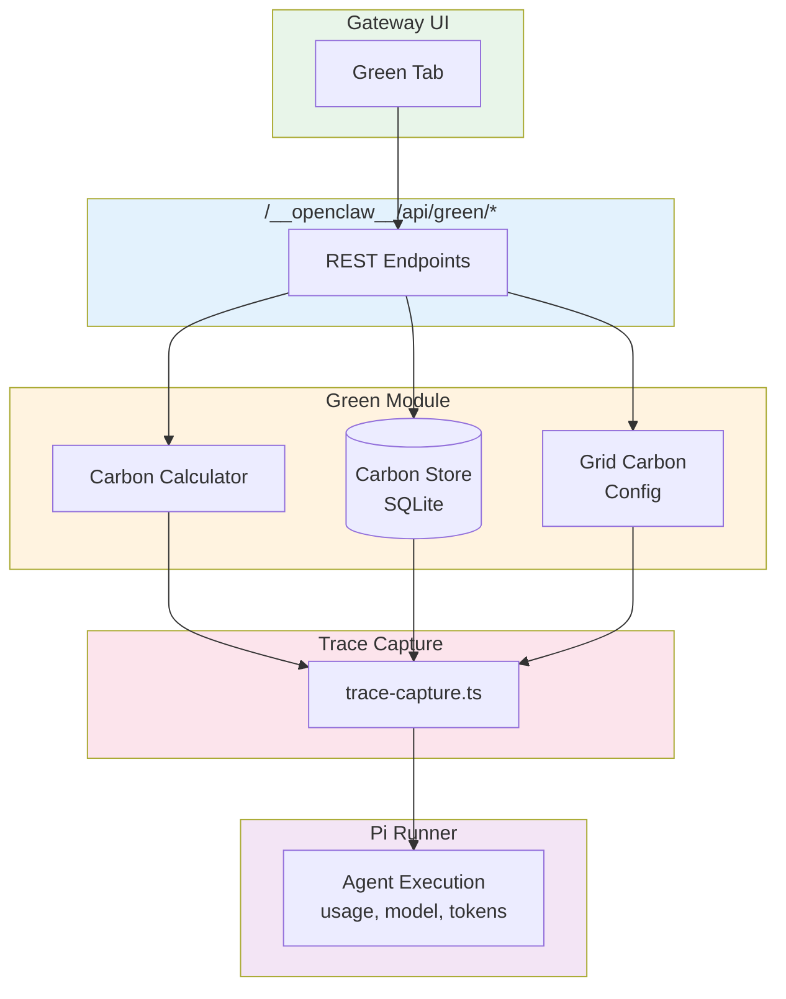

# Green Module

> Accountability-first, always-on carbon footprint and environmental impact tracking for AI inference.

## The Problem

Every LLM inference request has an environmental cost:

- **Carbon emissions** from GPU power consumption
- **Water usage** for data center cooling
- **Embodied carbon** in hardware manufacturing

This cost is largely invisible. Providers don't disclose per-request emissions. Users have no way to understand, track, or reduce their AI environmental footprint.

OpenClaw surfaces this by default — not as guilt, but as **accountability and awareness**.

## Key Features

| Feature | Description |
|---------|-------------|
| **Always-on tracking** | Captures carbon data from the first request |
| **Per-request granularity** | Atomic traces that aggregate into summaries |
| **Conservative estimates** | Worst-case factors backed by academic research |
| **Confidence scoring** | Every estimate carries a 0.0–1.0 confidence |
| **Standards compliance** | GHG Protocol, CDP, TCFD, ISO 14064, SBTi |
| **Multiple interfaces** | CLI, Gateway dashboard, REST API |

## Quick Start

```bash
# Check your environmental impact
openclaw green status

# View intensity metrics (TCFD)
openclaw green intensity

# Export for GHG Protocol reporting
openclaw green export --format ghg-protocol --period 2025-Q1
```

## Architecture



## Next Steps

- [Installation](getting-started/installation.md) — Enable and configure tracking
- [Quick Start](getting-started/quick-start.md) — 5-minute walkthrough
- [Core Concepts](getting-started/concepts.md) — Understand traces, factors, confidence
- [CLI Reference](guides/cli-reference.md) — All commands documented
- [Standards](standards/ghg-protocol.md) — Compliance reporting guides
