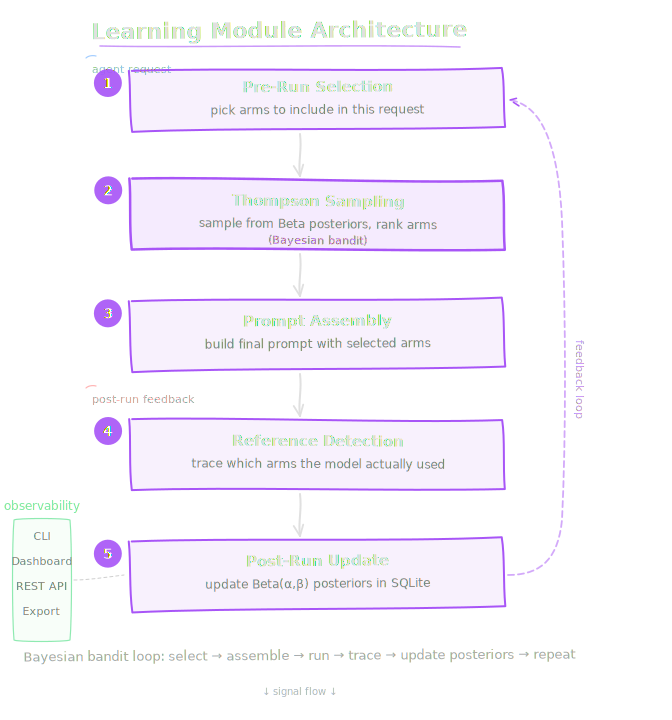

# Learning Module

> Always-on, zero-config active learning that discovers which tools and prompt sections actually help your agent.

## The Problem

AI agent prompts grow over time, but nobody knows what's working:

- **Prompt bloat** — Tools, memories, and instructions accumulate without review
- **No signal** — You can't tell which prompt sections the model actually uses
- **Token waste** — Unused context burns tokens on every request
- **Manual tuning** — Prompt optimization is guesswork without data

OpenClaw Learning solves this automatically. From the first request, it traces which components the model references and builds statistical posteriors that reveal what helps vs. what hurts.

## Key Features

| Feature | Description |
|---------|-------------|
| **Always-on tracing** | Captures arm outcomes from the first request |
| **Thompson Sampling** | Bayesian bandit that balances exploration and exploitation |
| **Two-phase operation** | Passive (observe only) or Active (optimize prompts) |
| **Baseline A/B** | Counterfactual evaluation with configurable baseline rate |
| **Token savings** | Measures actual token reduction vs. full-prompt baseline |
| **Multiple interfaces** | CLI, Gateway dashboard, REST API |

## Quick Start

```bash
# Check learning layer status
openclaw learning status

# Open the live dashboard
openclaw learning dashboard

# Export posteriors and traces
openclaw learning export --format json
```

## Architecture

<div style="max-width: 520px; margin: 0 auto;">
  
</div>

## Next Steps

- [Installation](getting-started/installation.md) — Verify and configure
- [Quick Start](getting-started/quick-start.md) — 8-step walkthrough
- [Core Concepts](getting-started/concepts.md) — Arms, posteriors, phases
- [CLI Reference](guides/cli-reference.md) — All commands documented
- [Thompson Sampling](theory/thompson-sampling.md) — How the bandit works
