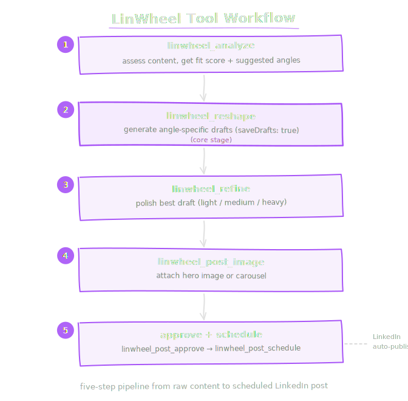

# LinWheel

`linwheel` is an **optional plugin** that exposes 17 agent tools for LinkedIn
content creation via the [LinWheel](https://www.linwheel.io) API. Analyze source
content, reshape it into angle-specific posts, refine drafts, attach images and
carousels, and manage the approval/scheduling pipeline.

## Enable the plugin

1) Enable the plugin with your API key:

```json
{
  "plugins": {
    "entries": {
      "linwheel": {
        "enabled": true,
        "config": {
          "apiKey": "lw_sk_..."
        }
      }
    }
  }
}
```

Or set `LINWHEEL_API_KEY` as an environment variable (plugin config takes priority).

2) Allowlist the tools (all are registered with `optional: true`):

```json
{
  "agents": {
    "list": [
      {
        "id": "main",
        "tools": { "allow": ["linwheel"] }
      }
    ]
  }
}
```

## Config

```json
{
  "plugins": {
    "entries": {
      "linwheel": {
        "enabled": true,
        "config": {
          "apiKey": "lw_sk_...",
          "signingSecret": "lw_whsec_...",
          "baseUrl": "https://www.linwheel.io",
          "timeoutMs": 60000
        }
      }
    }
  }
}
```

| Key | Required | Default | Description |
|-----|----------|---------|-------------|
| `apiKey` | Yes | `$LINWHEEL_API_KEY` | API key (starts with `lw_sk_`) |
| `signingSecret` | No | `$LINWHEEL_SIGNING_SECRET` | HMAC signing secret |
| `baseUrl` | No | `https://www.linwheel.io` | API base URL |
| `timeoutMs` | No | `60000` | Request timeout in ms |

## Tools

### Content processing

| Tool | Description |
|------|-------------|
| `linwheel_analyze` | Assess text for LinkedIn potential. Returns fit score and suggested angles. |
| `linwheel_reshape` | Decompose text into angle-specific draft posts. Can save drafts to LinWheel. |
| `linwheel_refine` | Run an LLM editing pass on a draft (light, medium, or heavy). |
| `linwheel_split` | Split long content into a multi-post series. |

### Drafting

| Tool | Description |
|------|-------------|
| `linwheel_draft` | Create a single draft post with optional scheduling. |
| `linwheel_bundle` | Create a draft with image and/or carousel in one call. |

### Post management

| Tool | Description |
|------|-------------|
| `linwheel_posts_list` | List posts with optional filters (approved, scheduled, limit). |
| `linwheel_post_get` | Get a single post by ID. |
| `linwheel_post_update` | Update a post's text or metadata. |
| `linwheel_post_approve` | Mark a post as approved (or unapprove). |
| `linwheel_post_schedule` | Schedule a post for auto-publish. Pass empty string to unschedule. |

### Visuals

| Tool | Description |
|------|-------------|
| `linwheel_post_image` | Generate a typographic hero image for a post. |
| `linwheel_post_carousel` | Generate a text carousel (1-10 slides) for a post. |

Style presets: `typographic_minimal`, `gradient_text`, `dark_mode`, `accent_bar`, `abstract_shapes`.

### Voice profiles

| Tool | Description |
|------|-------------|
| `linwheel_voice_profiles_list` | List all voice profiles. Shows which is active. |
| `linwheel_voice_profile_create` | Create a voice profile from writing samples (3+ recommended). |
| `linwheel_voice_profile_delete` | Delete a voice profile by ID. |
| `linwheel_voice_profile_activate` | Set a voice profile as active. Only one active at a time. |

## Angles

LinWheel supports these post angles for reshape:

| Angle | Description |
|-------|-------------|
| `field_note` | First-person observation from the trenches |
| `contrarian` | Challenge conventional wisdom |
| `demystification` | Break down a complex topic |
| `identity_validation` | "You're not alone" resonance |
| `provocateur` | Deliberately provocative take |
| `synthesizer` | Connect disparate ideas |
| `curious_cat` | Ask a question that sparks discussion |

## Cadence integration

The LinWheel Publisher responder automatically generates drafts when you write
`::linkedin` at the top of an Obsidian note. See [Cadence](/cadence/) for details.

## Example workflow

<div style="max-width: 600px; margin: 1rem auto;">
  
</div>
